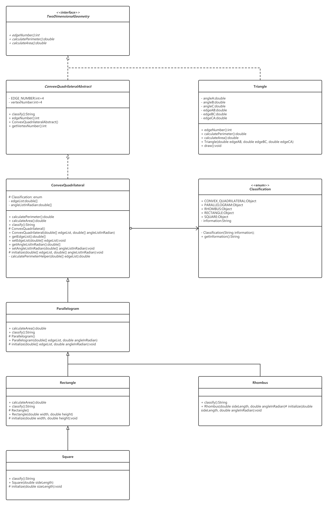

# geometry

### Introduction

It is the first attempt at Java object-oriented design (OOD).

It is also a sample usage of the following:

- class
  - interface
  - abstract class
  - concrete class
  - enumeration
- access modifier
  - private / protected / public
  - static
  - final
- UML class diagram

### UML

https://www.processon.com/view/link/5e825463e4b08c5b86f26e3d

